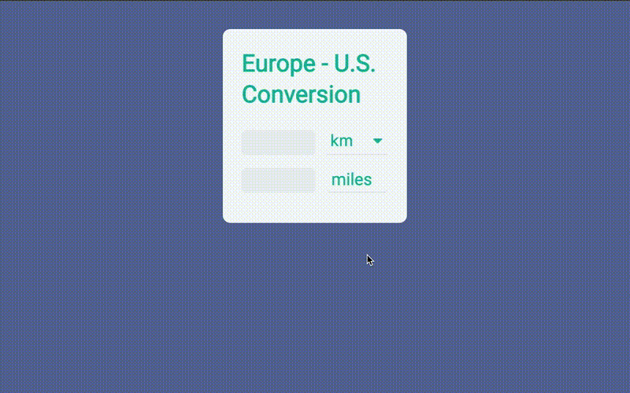

# Metric Converter

**Tool to convert units like km, miles, liter, cups, ˚C, ˚F, € and $, vanilla Javascript.**

This was my first ever project that I did on my own, not following an online tutorial etc. and marked the beginning of what would become my passion for coding.

- Javascript DOM manipulation to display the results
- The conversion rate for the currencies come from a currency API