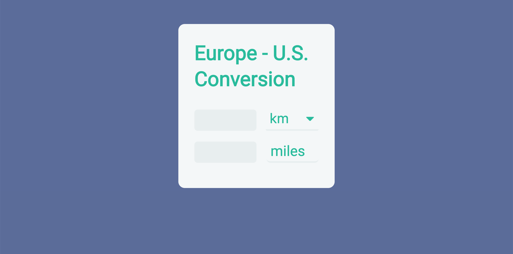
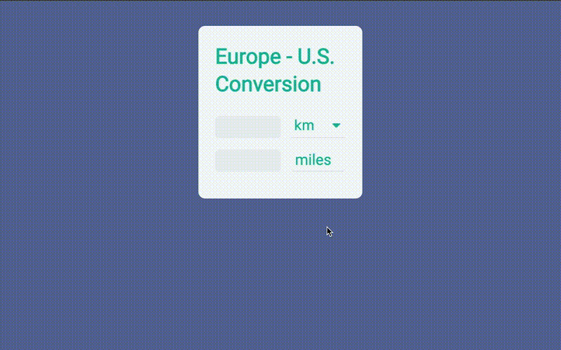

This is a sentimental one, as it marks the beginning of what would become my passion for web development. Finding myself constantly struggling with conversions for km, miles, liter, cups, ˚C, ˚F, € and \$, I made this converter.

[europe-us-converter.herokuapp.com](https://europe-us-converter.herokuapp.com/)

---

This project is special to me, because it was the first time I was sitting down to create something on my own, without following a tutorial or instructions.

After watching a speech on great UI, I styled it, and needless to say, felt invincible when it all came together working in the end.

---

### Logic

This project was written in vanilla HTML, CSS and JavaScript. A currency API provides the conversion rate for \$ and €.

---
